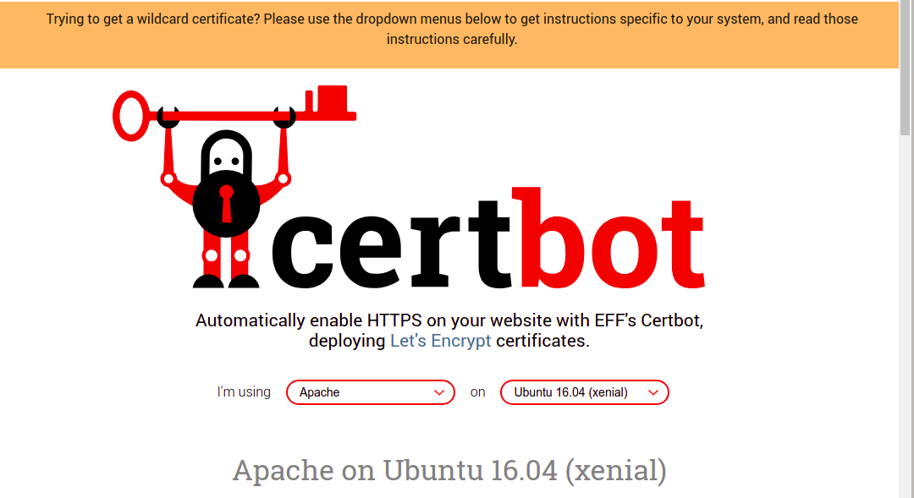
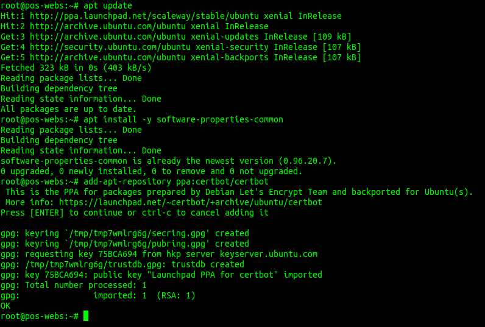
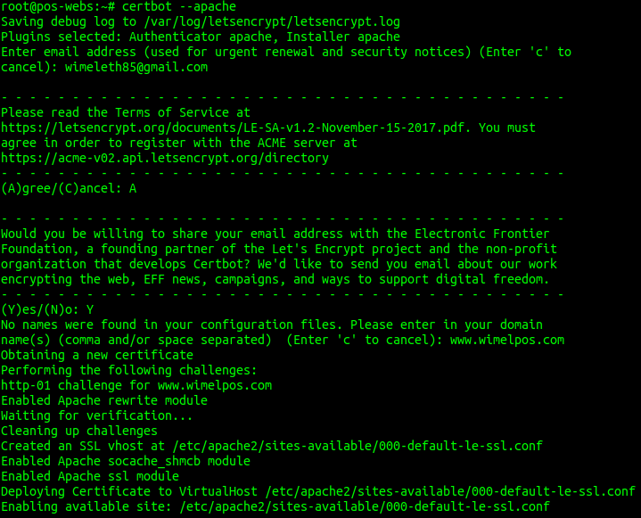
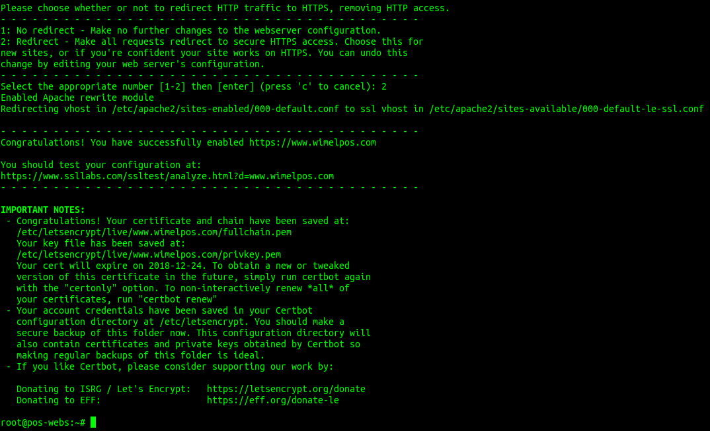
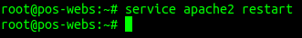
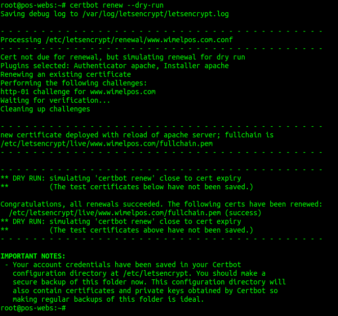

> Aquí puedes encontrar los recursos necesarios para hacer tu web más segura con `HTTPS`. 

* Vamos a hacer que nuestra web use `HTTPS` y que todo el tráfico que entre por `HTTP` lo redirija a `HTTPS`. 
Esto lo vamos a hacer con [Let’s Encrypt](https://letsencrypt.org/) y [Certbot](https://certbot.eff.org/) _(en la página de Certbot está todo muy bien explicado)_, entramos en la página web de certbot, elegimos el software que estamos usando y el sistema operativo.

<p align="center"> 

</p>

* Podemos apreciar que justo debajo nos aparecen los pasos a seguir, así que tecleamos en la terminal:

```
apt update
apt install -y software-properties-common
add-apt-repository ppa:certbot/certbot
apt update 
apt install -y python-certbot-apache
```

<p align="center"> 

</p>

* Certbot tiene un Plug-in para Apache que funciona bien (aún está en beta).
Vamos rellenando los datos que nos pide (importante seleccionar la opción 1 como muestra la segunda imagen para que nos redirija todo el tráfico a HTTPS):

```
certbot --apache
```

<p align="center"> 

</p>

<p align="center"> 

</p>

* Recargamos apache con la nueva configuración:

```
service apache2 restart
```

<p align="center"> 

</p>

* Certbot tiene una opción para renovar los certificados automáticamente, solo tenemos que introducir lo siguiente en la terminal (los certificados de Let’s Encrypt duran 90 días, por lo que es aconsejable usar esta función):

```
certbot renew –dry-run
```

<p align="center"> 

</p>

> Con estos pasos podemos hacer nuestra web más segura y proteger a los usuarios que navegen por ella.