<h1 align="center">Brave </h1>

En este repositorio puedes encontrar documentación y pasos para darse de alta en la plataforma de [Brave](https://brave.com) para [publishers](https://publishers.basicattentiontoken.org).

## Es necesario que nuestra web tenga un certificado HTTPS, si necesitas incorporarlo puedes seguir [estos pasos]()

# Empezando con Brave publishers:

## Necesitamos crear una cuenta en [Uphold](https://uphold.com/) para gestionar los pagos y nuestros fondos de una manera más sencilla, estos son los pasos a seguir:

* Nos dirigimos a [Uphold](https://uphold.com) y hacemos clic en _“Sign up”_.

* Rellenamos nuestros datos, email, contraseña, país de residencia etc, y hacemos clic en _“CONTINUAR”_ **_(como nos indican, tiene que ser una contraseña segura)_**

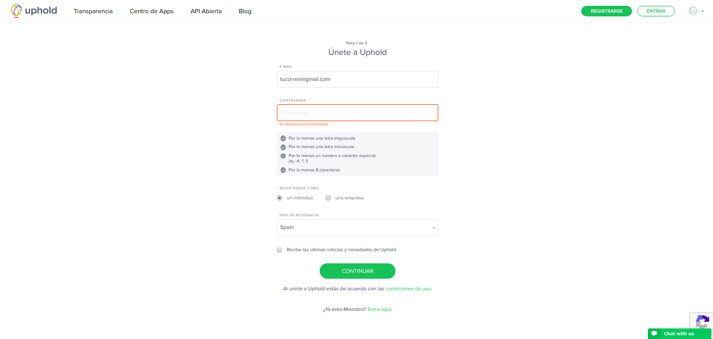

* Completamos la información personal y hacemos clic en _“CONTINUAR”_

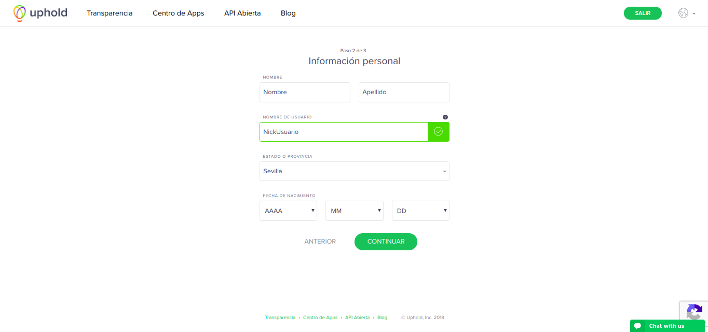

* Nos mandan un correo de confirmación al email introducido anteriormente.

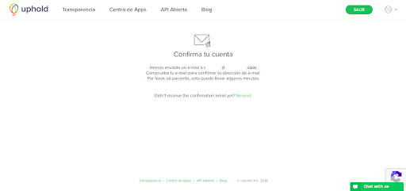

* Hacemos clic en el link que nos han enviado a nuestro mail.

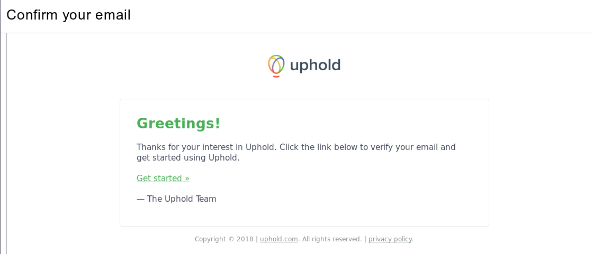

* Iniciamos sesión en Uphold, escribimos nuestro número de teléfono para darle más seguridad a nuestra cuenta usando [Authy](https://authy.com), y hacemos clic en _“ENVIAR CÓDIGO”_. 

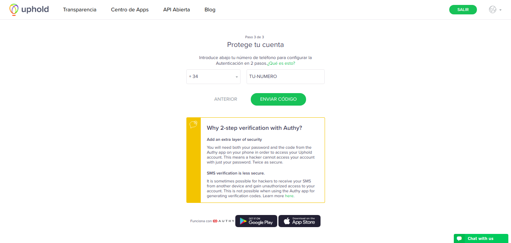

* Nos mandarán un mensaje al móvil indicado anteriormente con un enlace al [Appstore](https://itunes.apple.com/us/app/authy/id494168017) (Iphone) o [Google Play](https://play.google.com/store/apps/details?id=com.authy.authy) (Android).

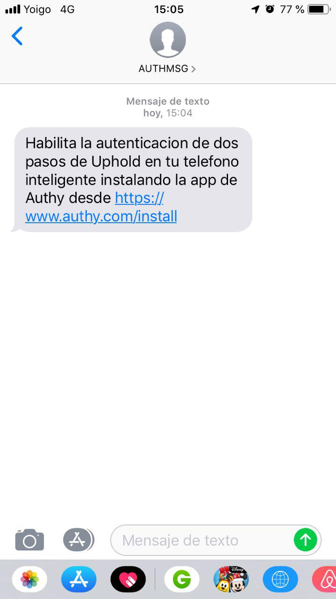

* Instalamos la app de [Authy](https://authy.com/download/), y vamos siguiendo los pasos que nos indican.

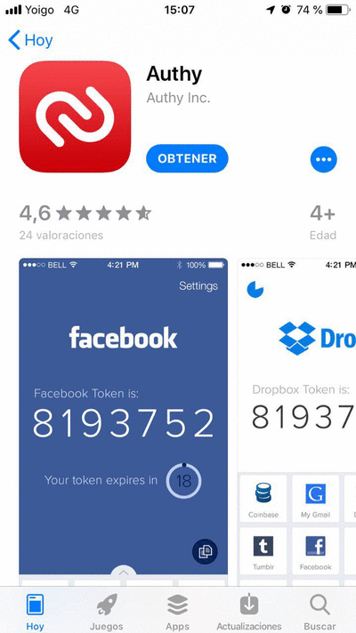

* El siguiente paso es darnos de alta en Brave como creadores de contenido. Para ello nos dirigimos a [Brave-creators](https://brave.com/creators/) y hacemos clic en _“Become a Creator”_

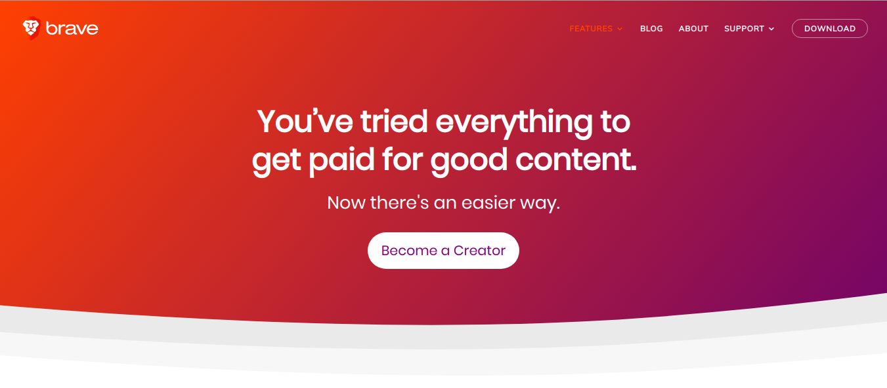

* En la siguiente ventana que nos aparece hacemos clic en _“GET STARTED”_

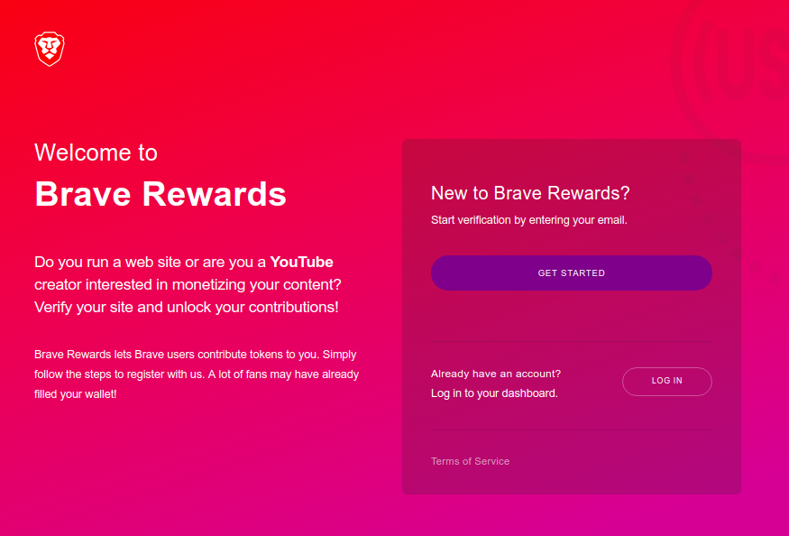

* Introducimos nuestro email y hacemos clic en _“Get Started”_

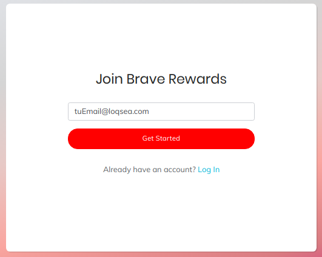

* Recibiremos un email con un enlace, hacemos clic en él.

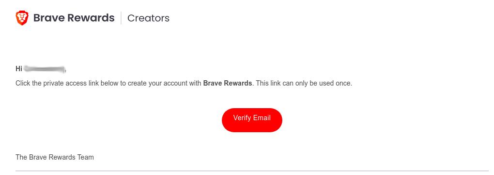

* Rellenamos los datos y hacemos clic en _“Sign Up”_

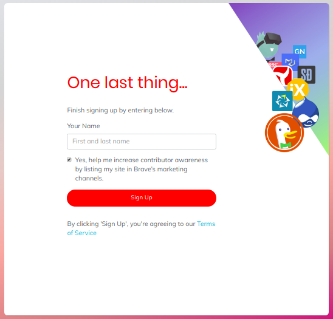

* En caso de tener alguna aplicación para el segundo factor, en este paso podemos configurarlo. Para esta guía vamos a omitirlo (si necesitáis una guía de configuración de segundo factor dejadlo en los comentarios), hacemos clic en _“Skip for now”_

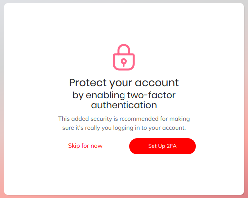

* Una vez realizados estos pasos podemos ver nuestra página principal de [Brave Creators](https://brave.com/creators/)

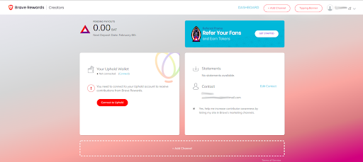

* Ahora vamos a añadir nuestro sitio web y a generar el token necesario para verificarlo. Para ello, hacemos clic en _“Add Channel”_

* Elegimos qué queremos dar de alta, en mi caso _“WEBSITE”_

* Introducimos nuestra web en el recuadro (para el ejemplo, vamos a proceder a dar de alta la web de la [Colmena](https://www.coworkingcolmena.com/)) y hacemos clic en _“Continue”_

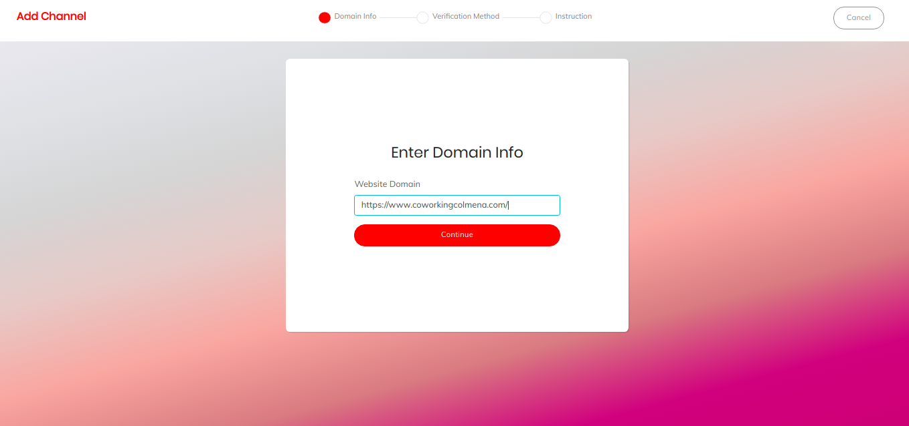

* En el siguiente paso nos muestra dos opciones para verificar nuestra página web, en mi caso voy a elegir  _“I’ll use a trusted file”_

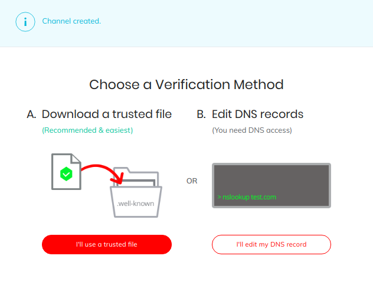

* Una vez que hemos hecho clic, nos muestra un archivo que debemos guardar con el token necesario para enlazar nuestra web con Brave (no debemos modificar ni el nombre ni el contenido de ese archivo). Para ello hacemos clic en _“Download”_.
Dejamos esta ventana abierta para la verificación posterior.

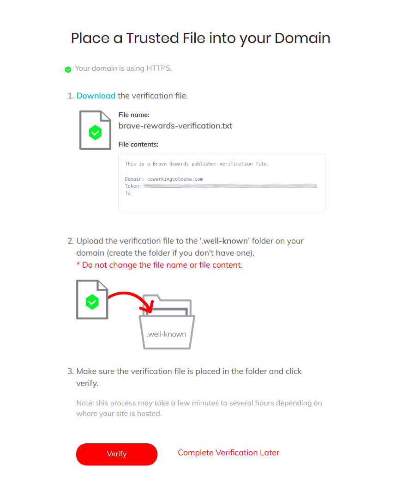

## Tenemos dos opciones para introducir este archivo en nuestra web: desde la terminal o instalando el complemento de wordpress.

## Desde la terminal:

* Nos dirigimos donde tengamos nuestra web situada (en mi caso `/var/www/html/`)

`cd /var/www/html`

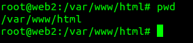

* Creamos una carpeta llamada “.well-known”

`mkdir .well-known`

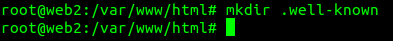

* Entramos en la carpeta, creamos el archivo y copiamos en el interior el contenido del archivo descargado anteriormente, guardamos y salimos.

`nano brave-rewards-verification.txt`

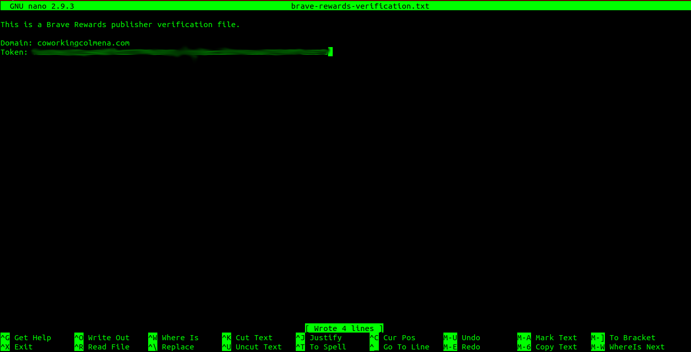

## Desde el complemento de wordpress

### El plugin de wordpress creará por nosotros el fichero sin necesidad de hacerlo manualmente.

* Descargar el [plugin](https://wordpress.org/plugins/brave-payments-verification/)

* Instalarlo en `/wp-content/plugins/` 

* Ir a _Settings_ > _Brave Payments Verification_ y añadir el token obtenido del fichero de verificación y hacer click en _Save Changes_

**Nota:** Una vez hayamos recibido confirmación por email de que el sitio está verificado, podemos desactivar este plugin.

## Una vez que hemos realizado los pasos anteriores vamos a proceder a verificar nuestra web

* Nos dirigimos a la página anterior y hacemos clic en _“Verify”_

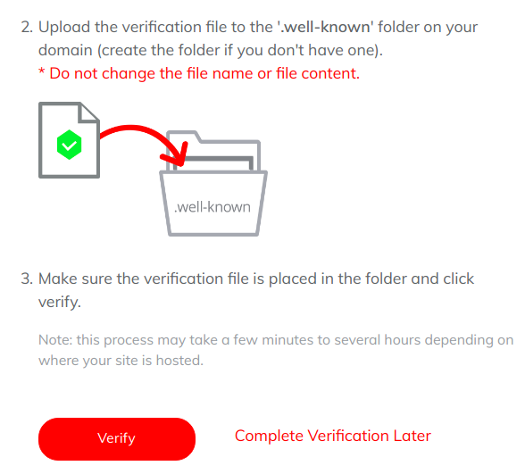

_**Con estos pasos ya tenemos nuestra web de alta en Brave Creators; si nos dirigimos a nuestra página principal en Brave Rewards podemos ver que nos aparece nuestra web.**_

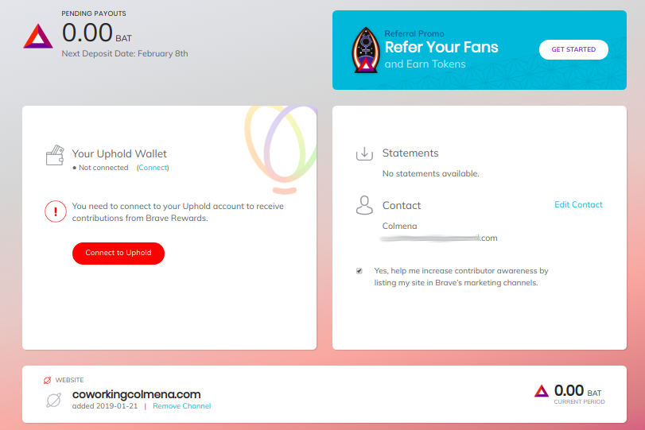
